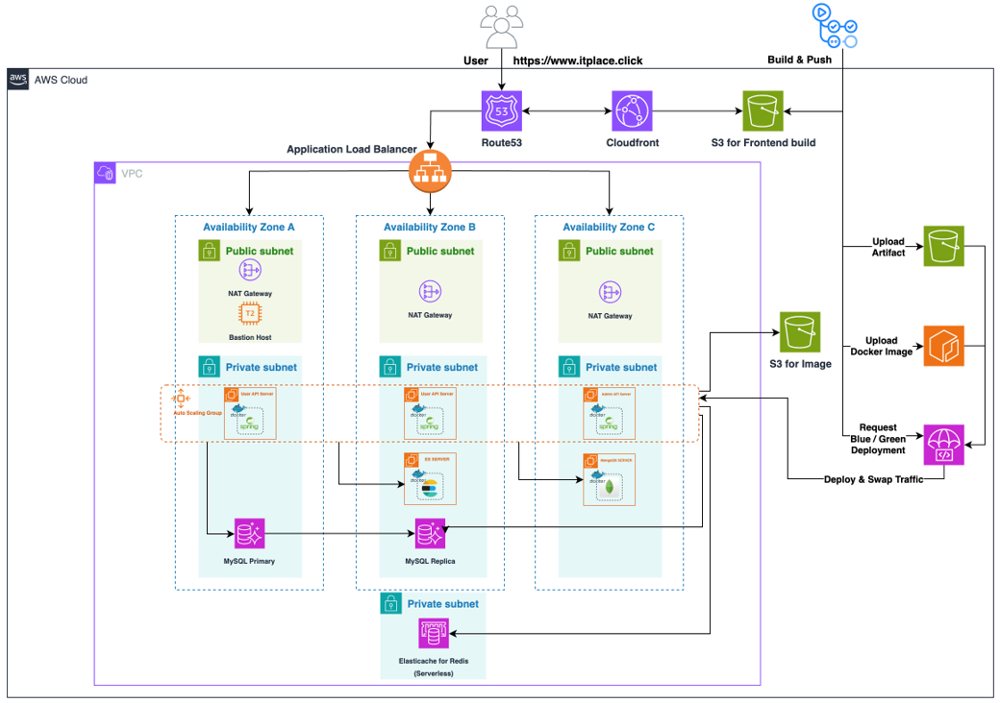
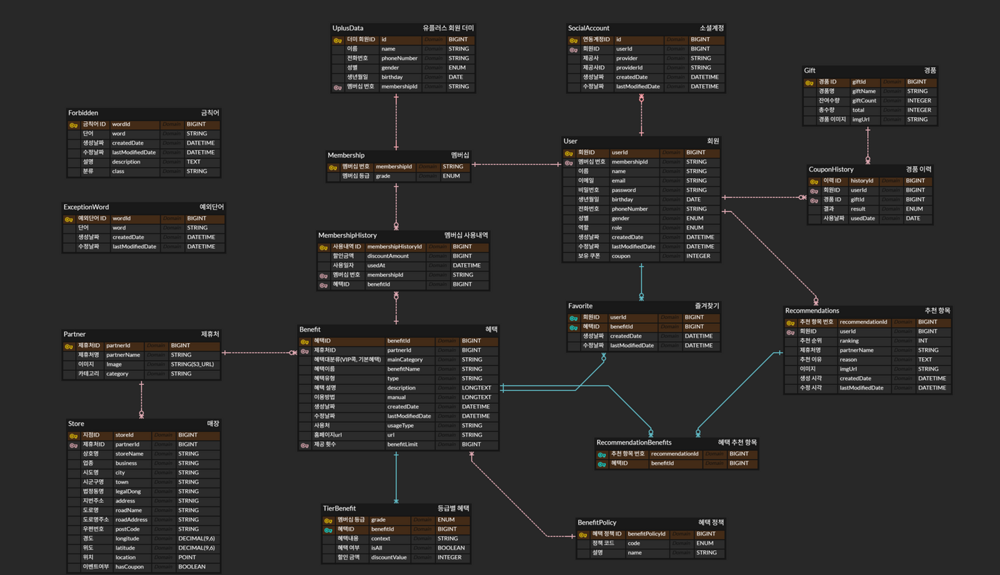

# 📌 itPlace – 통신사 멤버십 제휴처 안내 지도 서비스 플랫폼

<p align="center">
  <em>통신사 멤버십 혜택을 한눈에!</em><br>
  제휴처 위치 안내부터 AI 추천, 통계 관리까지 한 번에 제공하는 플랫폼
</p>

---

## 🚀 주요 기능

#### 👤 회원가입/로그인

- 일반 회원가입 및 소셜 로그인 지원
- LG U+ 멤버십 연동 시 기본 정보 자동 불러오기
- 번호 인증, 이메일 인증, reCAPTCHA를 통한 보안 강화
- 개인정보 수정 및 회원 탈퇴 기능 제공

---

#### 🗺️ 지도 및 위치 기반 시스템

- Kakao Map API를 활용한 제휴처 마커 표시
- 로드뷰 지원으로 실제 위치 확인 가능
- GPS 기반 현재 위치 탐색 및 반경 내 검색
- 거리순 정렬, 카테고리별 필터링 기능
- 사용자 데이터를 활용한 AI 기반 혜택 추천
- 사용자 지정 위치로 재검색 가능
- 혜택 사용 버튼 및 거리 제한 조건으로 무분별한 사용 방지
- 제휴처 홈페이지 외부 링크 이동 기능 지원

---

#### 🏪 혜택 및 제휴처 정보 제공

- 제휴처 위치 및 혜택에 대한 상세 정보 제공
- 멤버십 등급별 혜택 정보 표시
- 즐겨찾기 기능으로 원하는 혜택 저장
- 사용자 검색 로그 기록 저장
- 혜택 사용 이력 및 누적 혜택 금액 조회 가능
- 제휴처 홈페이지 리다이렉트 기능 제공

---

#### 🤖 AI 추천 & 질문 서비스

- 멤버십 혜택 이력 & 사용자 행동 로그를 반영한 개인 맞춤 추천
- 사용자 질문 의도에 맞는 AI 제휴처 정보 제공
- 금칙어 필터링
- 로그를 활용한 추천 콜드 스타트 완화

---

#### 📊 이벤트 페이지 & 프로모션 기능

- 지도 내 이벤트 지점을 통한 혜택 사용 유도
- 스크래치 카드 기반 이벤트 기능 제공
- 로그인 여부 및 보유 쿠폰 수에 따라 긁기 제한 제어

---

## 👥 개발팀 소개

<p align="center">
<table>
  <tr>
    <td align="center" valign="top">
      <br>
      <strong>허승현</strong>
      <hr style="width:80%; border-color:gray;">
      <sub>팀장<br>AI 추천<br></sub><br>
      <a href="https://github.com/HSH-11"></a>
    </td>
    <td align="center" valign="top">
      <br>
      <strong>이희용</strong>
      <hr style="width:80%; border-color:gray;">
      <sub>인증·인가<br>인프라<br>지도 서비스</sub><br>
      <a href="https://github.com/eddie-backdev"></a>
    </td>
    <td align="center" valign="top">
      <br>
      <strong>정현경</strong>
      <hr style="width:80%; border-color:gray;">
      <sub>제휴처 시스템<br>이벤트 서비스<br>관리자 페이지</sub><br>
      <a href="https://github.com/hyunnk"></a>
    </td>
    <td align="center" valign="top">
      <br>
      <strong>하령경</strong>
      <hr style="width:80%; border-color:gray;">
      <sub>로그 저장<br>관리자 대시보드<br>지도 서비스</sub><br>
      <a href="https://github.com/rxgx424"></a>
    </td>
  </tr>
</table>
</p>


---

## 🛠기술 스택

#### 🔧 백엔드

<p align="left">
 


</p>

#### ⚙️ 인프라

<p align="left">


</p>

---

## 🖥️ 인프라 구조



## 🕸️ ERD



## 📁 프로젝트 구조

```text
📦 itplace-user-api
├─ src/main/java/com/itplace/userapi
│  ├─ common        # 공통 유틸/DTO
│  ├─ ai            # AI 서비스
│  ├─ event         # 이벤트 기능
│  ├─ history       # 멤버십 혜택 이력
│  ├─ log           # 사용자 행동 로그
│  ├─ recommend     # 제휴처 추천    
│  ├─ benefit       # 혜택 관리
│  ├─ partner       # 제휴처 정보
│  ├─ security      # 인증·권한
|  ├─ map           # 지도 
│  ├─ user          # 사용자 관리
│  └─ favorite      # 즐겨찾기
├─ src/main/resources
├─ docs            # 프로젝트 문서
└─ README.md
